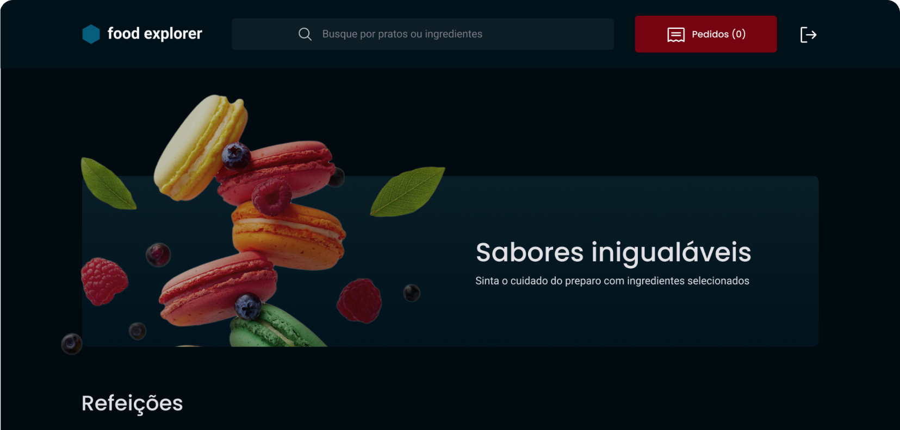

<h1 align="center"> Food_Explorer_backend </h1>

  <a href="#project">Technologies</a>&nbsp;&nbsp;&nbsp;|&nbsp;&nbsp;&nbsp;
  <a href="#deployment">Deployment</a>&nbsp;&nbsp;&nbsp;|&nbsp;&nbsp;&nbsp;
  <a href="#project">Project</a>

  

## Technologies

This project was developed with the following technologies:

- Javascript
- Git and GitHub
- Knexjs
- SQLite
- Node.js

## Deployment

The project is deployed and available at: [Food Explorer Backend](https://food-explorer-backend-whvz.onrender.com)

## Project

- Food_Explorer_backend is a robust backend that centralizes and connects your food in a simple and efficient way, bringing users and information together in one place.